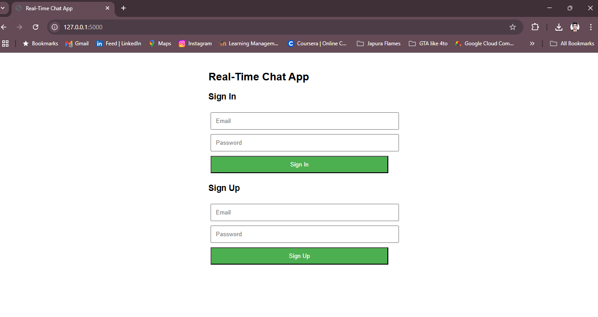
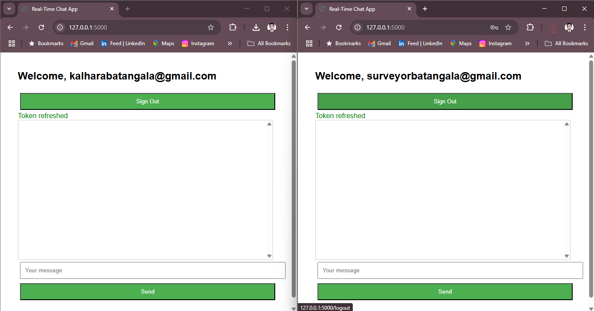
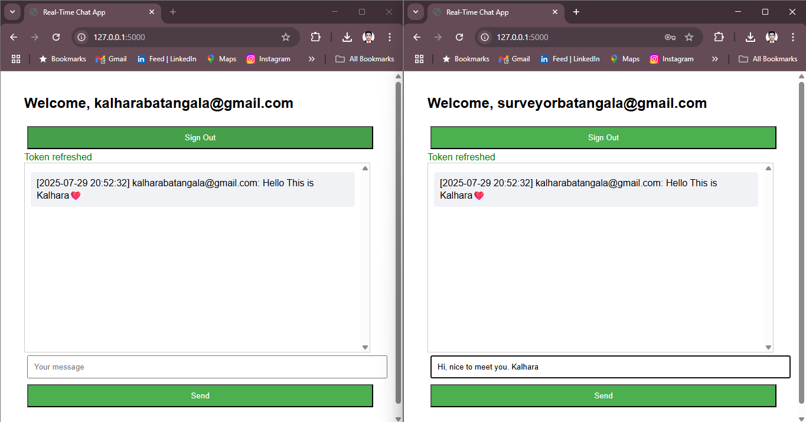
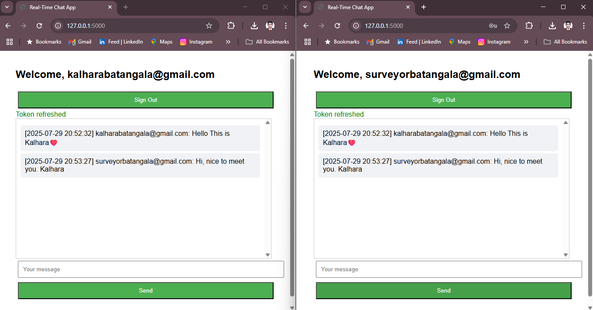
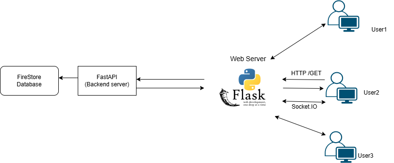

# Real-Time Chat Application

A web-based chat application with user authentication and real-time group messaging, built to showcase full-stack development and DevOps skills. This project demonstrates my ability to design, troubleshoot, and deploy a modern web app while overcoming real-world challenges like WebSocket instability and framework limitations.

## Features

- **User Authentication**: Secure sign-up and login using Firebase Authentication (Email/Password).
- **Real-Time Group Chat**: Send and receive messages instantly across all connected users.
- **Message Persistence**: Store chat messages in Firebase Firestore with user ID and timestamp.
- **Deployment**: Deployed on AWS Elastic Beanstalk using Docker for scalability.
- **Version Control**: Managed with Git and GitHub, with iterative development in the `flask-frontend` branch.

## Tech Stack

### Original Version (Main Branch - Streamlit)
- **Backend**: FastAPI (Python) with WebSocket support (`/ws`) for real-time messaging.
- **Frontend**: Streamlit (Python) for a simple, Python-based UI.
- **Authentication**: Firebase Authentication (Email/Password).
- **Database**: Firebase Firestore for message storage.
- **Dependencies**: `fastapi`, `uvicorn`, `firebase-admin`, `pyrebase4`, `websocket-client`.
- **Deployment**: AWS Elastic Beanstalk, Docker.
- **Version Control**: Git, GitHub (main branch).

**Note**: This version is non-functional due to WebSocket disconnections caused by Streamlit’s rerun behavior.

### Current Version (Flask-frontend Branch - Working)
- **Backend**: FastAPI (Python) with HTTP endpoint (`/send_message`) for message storage.
- **Frontend**: Flask (Python) with Socket.IO for stable real-time messaging.
- **Authentication**: Firebase Authentication (Email/Password).
- **Database**: Firebase Firestore for message storage.
- **Dependencies**: `fastapi`, `uvicorn`, `firebase-admin`, `pyrebase4`, `flask`, `flask-socketio`, `python-socketio`.
- **Deployment**: AWS Elastic Beanstalk, Docker.
- **Version Control**: Git, GitHub (`flask-frontend` branch).

## Project Journey and Challenges

### Original Plan with Streamlit (Main Branch)
The initial goal was to build a real-time chat app using **FastAPI** for the backend and **Streamlit** for the frontend, integrated with **Firebase** for authentication and data storage. The setup was:
- **Backend**: FastAPI (`main.py`) provided an HTTP endpoint (`/`) and a WebSocket endpoint (`/ws`) at `http://localhost:8000`. It handled Firebase authentication, stored messages in Firestore, and broadcast messages to WebSocket clients.
- **Frontend**: Streamlit (`app.py`) served a Python-based UI at `http://localhost:8501`, using `websocket-client` to connect to FastAPI’s `/ws` for real-time messaging.
- **Workflow**:
  1. Users sign up/log in via Firebase Authentication.
  2. Streamlit connects to `ws://localhost:8000/ws`.
  3. Messages are sent to FastAPI, stored in Firestore, and broadcast to all `/ws` clients.

#### Challenges Faced
1. **React #231 Error**:
   - **Issue**: Streamlit’s React-based framework caused errors when integrating custom JavaScript for WebSocket communication (e.g., `st.components.v1.html`).
   - **Impact**: Limited dynamic UI updates, as Streamlit sanitizes HTML and restricts JavaScript.
   - **Solution**: Abandoned custom JavaScript in Streamlit, relying on Python-based WebSocket logic.

2. **Button Click Handling Issue**:
   - **Issue**: Streamlit doesn’t support inline `onClick` handlers (e.g., `<button onclick="sendMessage()">`) due to React’s event model, causing errors when adding JavaScript for message sending.
   - **Impact**: Forced use of Streamlit’s Python event handling, which conflicted with WebSocket persistence.
   - **Solution**: Used Streamlit’s `st.button` and `st.session_state` for temporary workarounds.

3. **WebSocket Disconnection Errors**:
   - **Issue**: Frontend showed “WebSocket not connected. Trying to reconnect...” errors, and backend logs reported `WebSocket disconnected`.
   - **Cause**: Streamlit reruns the entire `app.py` script on every user interaction (e.g., clicking “Send”), closing the WebSocket connection (`st.session_state.ws`).
   - **Impact**: Prevented reliable real-time messaging.
   - **Lesson**: Streamlit’s reactive model is incompatible with stateful WebSocket connections.

#### Point of Failure
Streamlit’s **rerun behavior** was the core issue:
- **Problem**: Each user action (e.g., sending a message) triggered a script rerun, terminating the WebSocket thread.
- **Why Unsuitable**:
  - Streamlit is designed for data dashboards, not real-time apps requiring persistent connections.
  - Limited JavaScript support restricted integration with modern real-time libraries like Socket.IO.
- **Outcome**: The backend worked (messages stored in Firestore), but the frontend couldn’t maintain WebSocket connections, making the app non-functional.

### Transition to Flask + Socket.IO (Flask-frontend Branch)
To resolve these issues, we pivoted to **Flask + Socket.IO** in the `flask-frontend` branch. Flask is a lightweight Python web framework that:
- Avoids reruns, ensuring stable connections.
- Supports HTML templates with JavaScript (Socket.IO) for real-time messaging.
- Integrates seamlessly with the FastAPI backend and Firebase.

#### Key Changes
- **Frontend**: Replaced Streamlit with Flask (`app.py`), serving `login.html` and `chat.html` templates at `http://localhost:5000`.
- **Real-Time Messaging**: Switched from FastAPI’s raw WebSocket (`/ws`) to Socket.IO for broadcasting messages.
- **Backend**: Simplified FastAPI (`main.py`) to handle HTTP POST (`/send_message`) for Firestore storage, removing the unused `/ws` endpoint.
- **Fixes**:
  - **Signup Error**: Fixed `BadRequestKeyError: KeyError: 'email'` by adding `email` and `password` fields to the signup form in `login.html`.
  - **Message Display Issue**: Messages weren’t appearing because FastAPI broadcast to `/ws` (no clients connected), while `chat.html` used Socket.IO. Added `socketio.emit` in `app.py` to broadcast messages to Socket.IO clients.

#### WebSocket vs. Socket.IO
- **WebSocket**:
  - A low-level protocol (RFC 6455) for persistent, two-way communication over `ws://` or `wss://`.
  - Used in the Streamlit version via FastAPI’s `/ws` endpoint.
  - Requires manual handling of connections, reconnections, and message formats (e.g., JSON `{ "token": ..., "message": ... }`).
  - **Pros**: Lightweight, standardized.
  - **Cons**: Complex to manage, no built-in reconnection or event system.
- **Socket.IO**:
  - A library built on WebSocket (or HTTP polling as a fallback) for real-time communication.
  - Used in the Flask version, with `flask-socketio` (server) and `socket.io.js` (client in `chat.html`).
  - Provides event-based messaging (e.g., `socket.on("message", ...)`), automatic reconnection, and fallbacks.
  - **Pros**: Developer-friendly, simplifies real-time apps, integrates well with browser JavaScript.
  - **Cons**: Slightly more overhead than raw WebSocket.
- **Why Switch?**:
  - Streamlit’s reruns broke WebSocket connections, making `/ws` unreliable.
  - Flask + Socket.IO supports stable connections and integrates with `chat.html`’s JavaScript, enabling real-time updates.
  - Simplified backend by moving broadcasting to Flask, reducing FastAPI’s role to HTTP and Firestore.

#### Message Flow (Flask Version)
1. **Browser Loads UI**: HTTP GET to `http://localhost:5000/` (Flask) serves `chat.html`.
2. **Socket.IO Connection**: `chat.html` connects to Flask’s Socket.IO server (`ws://localhost:5000/socket.io/`).
3. **Send Message**: User types “Hello, world!” and clicks “Send” in `chat.html`, emitting a Socket.IO `message` event to Flask.
4. **Flask to FastAPI**: Flask sends HTTP POST to `http://localhost:8000/send_message`, storing the message in Firestore.
5. **Broadcast**: Flask broadcasts the message to all Socket.IO clients via `socketio.emit("message", ...)`.
6. **UI Update**: `chat.html` receives the `message` event and displays `[2025-07-29 19:00:00] user@example.com: Hello, world!`.

## Setup Instructions

### Prerequisites
- Python 3.9+
- Git, Docker, AWS CLI (for deployment)
- Firebase project with Authentication (Email/Password) and Firestore enabled
- `firebase-adminsdk.json` from Firebase Console

### Flask-frontend Branch (Recommended - Working Version)
1. **Clone the Repository**:
   ```bash
   git clone https://github.com/KalharaBatangala/RealTime-chat-app.git
   cd RealTime-chat-app
   git checkout flask-frontend
   ```

2. **Set Up Virtual Environment**:
   ```bash
   python -m venv venv
   source venv/bin/activate  # On Windows: venv\Scripts\activate
   pip install -r requirements.txt
   ```

3. **Set Up Firebase**:
   - Create a Firebase project at [console.firebase.google.com](https://console.firebase.google.com).
   - Enable **Authentication** (Email/Password) and **Firestore**.
   - Set Firestore rules:
     ```plaintext
     rules_version = '2';
     service cloud.firestore {
       match /databases/{database}/documents {
         match /{document=**} {
           allow read, write: if request.auth != null;
         }
       }
     }
     ```
   - Download the service account key as `firebase-adminsdk.json` and place it in `D:\chat-app`.
   - Update `app.py` with your Firebase config (already set for `chat-app-ef643`).

4. **Run the Backend**:
   ```bash
   uvicorn main:app --reload
   ```
   - Access at `http://localhost:8000` (returns `{"message": "Chat App Backend"}`).

5. **Run the Frontend**:
   ```bash
   python app.py
   ```
   - Access at `http://localhost:5000`.

6. **Test the App**:
   - Sign up with an email (e.g., `test1@example.com`) and password (6+ characters).
   - Verify redirect to chat page with “WebSocket connected” status.
   - Send messages and confirm they appear in the UI and Firestore.
   - Open a second browser tab, sign up as `test2@example.com`, and test real-time messaging.

### Main Branch (Streamlit - Non-Functional)
**Note**: This version is included for reference but is not recommended due to WebSocket issues.
1. **Clone and Checkout**:
   ```bash
   git clone https://github.com/KalharaBatangala/RealTime-chat-app.git
   cd RealTime-chat-app
   git checkout main
   ```
2. **Follow Steps 2-4 Above**, then:
3. **Run Frontend**:
   ```bash
   streamlit run app.py
   ```
   - Access at `http://localhost:8501`.
4. **Expected Issues**: WebSocket disconnections due to Streamlit reruns.

## Deployment

### Docker
1. **Create Dockerfile**:
   ```dockerfile
   FROM python:3.9-slim
   WORKDIR /app
   COPY requirements.txt .
   RUN pip install -r requirements.txt
   COPY . .
   CMD ["sh", "-c", "uvicorn main:app --host 0.0.0.0 --port 8000 & python app.py"]
   ```
2. **Build and Run**:
   ```bash
   docker build -t chat-app .
   docker run -p 8000:8000 -p 5000:5000 chat-app
   ```
3. **Test**: Access `http://localhost:5000` (Flask) and verify messaging.

### AWS Elastic Beanstalk
1. **Initialize**:
   ```bash
   eb init -p docker chat-app --region us-east-1
   ```
2. **Create Environment**:
   ```bash
   eb create chat-app-env
   ```
3. **Deploy**:
   ```bash
   eb deploy
   ```
4. **Access**: Use the Elastic Beanstalk URL (e.g., `chat-app-env.us-east-1.elasticbeanstalk.com`).

## Screenshots








## Lessons Learned

- **WebSocket vs. Socket.IO**:
  - **WebSocket**: A raw protocol requiring manual connection management. Used in the Streamlit version (`/ws`), but failed due to reruns.
  - **Socket.IO**: A library built on WebSocket, offering event-based messaging and automatic reconnection. Used in Flask to ensure stable real-time updates.
  - **Key Difference**: WebSocket needs manual setup (e.g., JSON parsing), while Socket.IO simplifies with events (e.g., `socket.on("message", ...)`).
  - **Why Socket.IO?**: Easier integration with browser JavaScript, robust reconnection, and compatibility with Flask’s HTML templates.
- **Framework Selection**: Streamlit is ideal for data visualization but unsuitable for real-time apps. Flask + Socket.IO supports dynamic UIs and persistent connections.
- **Debugging**:
  - Used frontend logs (`python app.py`), backend logs (`uvicorn main:app`), and browser console (F12) to diagnose issues like `BadRequestKeyError` and missing messages.
  - Identified Streamlit’s rerun issue by analyzing WebSocket disconnections in backend logs.
- **DevOps Practices**:
  - **Git**: Managed iterative development with branches (`main`, `flask-frontend`), commits, and pushes.
  - **Docker**: Containerized the app for consistent environments.
  - **AWS**: Deployed to Elastic Beanstalk for scalable hosting.
- **Real-Time Architecture**: Learned to hybridize HTTP (for authentication, message storage) and Socket.IO (for real-time updates) for efficient communication.

## Future Improvements
- **UI Enhancements**: Add message styling (e.g., colors for different users) or chat bubbles.
- **Private Messaging**: Implement one-to-one chat or rooms using Socket.IO namespaces.
- **React Frontend**: Explore replacing Flask with React + Socket.IO for a modern SPA.
- **CI/CD**: Add GitHub Actions for automated testing and deployment.
- **Monitoring**: Integrate logging/monitoring tools (e.g., Prometheus) for production.

## License

[MIT License](LICENSE)